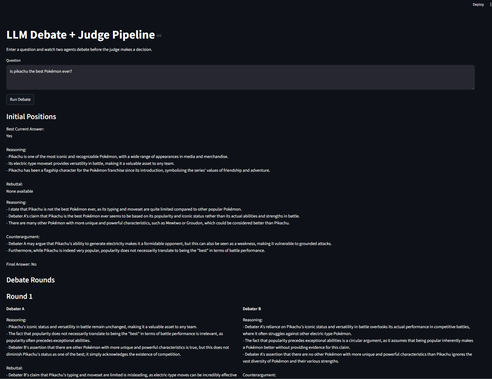

# LLM Debate with Judge Pipeline

## Overview
The assignment required a project that implemented Chain-of-Thought reasoning by implementing a adverserial multi-agent LLM reasoning systemssystem where two agents debate and a judge selects the final answer. Three LLMs were built and implemented to test wether a strucuted debate format performs better when measured by accuracy relative to a direct answer question format. The objective was to answer "Can a structured adverserial debate between two LLM agents, supervied by an LLM judge, produce more accurate and well reasoned answers than a single LLM answering directly?" Model and coding was supported using co-pilot within VS code editor and best coding methods were also reference using claude ai.

## 1. Methodolgy
system Architecture, debate protocol details, model choices and justification, configuration and hyperparameters.
### 1.1 System
System was set up to generate answer based on three approaches:
    - Direct QA
    - Self-Consistency
    - Debate + Judge

### 1.2 Debate Format of Pipeline
- The debate format of the pipeline was setup using two debate agents and a judge to determine the best answer of the two agents.
    1. Question is sent to both agents
    2. Each agent determines its own response and reasoning path
    3. Responses are passed to the judge
    4. Judge agent evaluates repsonses 


### 1.3 Model Selection
For the project I used a locally setup large language model called llama3.1:8b provided by Ollama.ai from "https://ollama.com/library/llama3.1:8b". The model was downloaded through the powershell interface to avoid the issues created by the UTSA VPN access through cloude services. The model has 8 billion paramters making it a confident and efficient model for reasoning. The use of model locally and not with cloud services avoided incurring costs and complete control of debate pipeline. The model was also recommended as one that has strong instruction following, chose this version over the llama1.1:70b due to the sheeer size to run locally and the resources recommended to run.

### 1.4 Model Configuration
The LLM model used from Ollam.ai was llama3.1:8b and  was setup with the following model configurations:
- Model: llama3.1:8b
- Temperature:
    - Debaters: 0.7
    - Judge: 0.1
    - Baseline: 0.8
- Max Tokens: 500
- Random Seed: 42


## 2. Experiments
Experimental setup, results tables/figures for experiments and tests.

### 2.1 Dataset
The project used the reasoining domain Commonsense QA and the StrategyQA dataset and used **120 sample questions** to create the data/questions.json file for the debate. The data consisted of question answer pairs stored in json and used ground truth format of yes/no. The selected binary sample quetions were used to evaluate the LLMs across all methods Debate + Judge, Direct QA, and Self Consistency. **3 samples for each question* were used to determine an answer by majority for final decision.

### 2.2 Experimental Setup
The project used local LLMs "llama3.1:8b" to compare 3 methods (Direct QA, Debate and Judge, and Self Consitency) using the same dataset:
- Dataset size: 120 questions
- Debate setup: Debater A, Debater B, and Judge
- Rounds: 3 to 4 rounds, quick stop after 2 agreeable responses
- Self Consistency: 3 reponses for majority vote
- Random Seed: 42 for reproduction of results

### 2.3 Results (Tables/Figures)
Debate + judge had the best results based on the accuracy metric with 0.65, well above the results of Direct QA with 0.44 and Self Consistency with 0.49 accuracy.

| Method              | Accuracy |
|---------------------|----------|
| Debate + Judge      | **0.65** |
| Direct QA           | 0.44     |
| Self-Consistency    | 0.49     |

<p align="center">
  
</p>

## 3. Analysis
Qualitative analysis of 3 selected adversarial debates  in a mutli-agent system and the relation to Irving et al. (2018)

### 3.1 Quantitative Analysis
For the quantitative analysis the first three debates were selected debate_1, debate_2, and debate_3. 

1. Debate_1: "Is Mixed martial arts totally original from Roman Colosseum games?"
    - Agreement 
    - Both LLMs debates came to the same outcome of "No" without requiring mutliple round of reasoning
    - The question may have been to easy for the LLMs as martial arts has a recorded history that the LLMs were trained on leading to a quick resolution between debaters and judge

2. Debate_2: "Is the cuisine of Hawaii suitable for a vegan?"
    - Failure 
    - Both agents came to the same conclusion and answered "Yes" which was opposite of the ground truth of "No"
    - Lack of debate confirmed a key failure between the LLM agents

3. Debate_3: "Is capturing giant squid in natural habitat impossible with no gear?"
    -  Disagreement 
    - Both agents debated multiple rounds as Debater stated that without any gear it was possible to capture a giant squid. Counter to Debater A, Debater B stated technology not available yet would make it possible to capture a giant squid and beleiving as of now it was impossible. Following multiple rounds of debte the judge selected Debater A's answer, which was the correct answer as the ground truth from the data set was "Yes".

### 3.2 Conclussion/Discussion
Reults of the multi-agent adversarial LLMs suggested that the use of debate is more accurate and should be implemented over the other two methods deployed, Direct QA and Self-Consistency.
- Case 1: Suggest imited to no gain with use of debate format if both models immediately agree with no rounds of debate
- Case 2 : Suggest when both models agree immediately with incorrect truths relative to the ground truth there is no gain in use of debate
- Case 3: Suggest when both models disagree and through multiple rounds of reasoning and the deliberation of a judge with the correct binary result, a net benefit is made from the debate model LLM format

### 3.3 Relation to Irving et al. (2018)
The multiple agent LLMs behavior was similiar to the Irving et al. (2018) results. The results concluded that adversarial debates improve the overall accuracy of reasoning models relative to Direct QA and Self Consistency through the reasoining of models by error identification. The model is limited to the capability of the reasoning assigned to the models based on the training parameters selected throug model selection and configurations settings of the model as previosly explained in section 1.

## 4. Prompt Engineering 
Process of creating iterated prompts by Debater A, Debater B, and the Judge. Explanation of role framing, CoT instructions and failure analysis.

### 4.1 Prompt Design Process
Initial deployment of configuration and prompts resulted in less than ideal results and required modification due to missing answers and unsupported reasoning. Was able to increase accuracy and the output by limiting the final response to yes no only and not allowing any following responses as the models had a habit of adding extra responses follwing the final answer causing formt issues which led to result analsis issues. Prompts were also modified to include debate histor to help with debugging and comparison of debates.
- Forced only Yes/No as final answer
- Restrict no text after final answer
- Full debate history

### 4.2 Role Framing
The Judge, Debter A (Proponent), and Debater B (Opponet) were each assigned a specific role for the project:
1. Debater A: Through reasoingin supports and advocates for an answer
2. Debater B: Through reasoning opposes an answer
3. Judge: Through observation of bother Debaters A and B reasoning selects the best case argument

### 4.3 CoT Instructions
Chain-of-Thought was used to promote the round by round reasoning of the debates
- Agents had clear instructions to share reasoning and respond to adversary debater
- Judge was set up to observe and select best answer based on debaters reasoning  and select a final answer with a reason as well
### 4.4 Failure Analysis
Debates were not guranteed to result in correct selections of answer by any party involved, and some questions had weak reasoning from all parties.


## 5. Appendix: Full Prompts
**Used Copilot within VS Code to help format the prompt section in Markdown.**

## Appendix: Full Prompts


<details>
<summary><strong>Debater A Prompt (Proponent)</strong></summary>

```text
You are Debater A, the Proponent in a structured adversarial debate.

Your goal is to defend the best answer to the question.

Instructions:
1. Give your best current answer.
2. Explain your reasoning clearly.
3. Use prior transcript context if available.
4. Critically attack weaknesses in the opponent's reasoning.
5. Keep your reasoning focused and concise.
6. You MUST end with exactly one final answer line.

Question:
{question}

Debate transcript so far:
{transcript}

Your previous answer:
{own_answer}

Opponent's current answer:
{opponent_answer}

Output format exactly:

Reasoning:
- point 1
- point 2
- point 3

Rebuttal:
- point 1
- point 2

Final Answer: Yes
OR
Final Answer: No

Do not write anything after the Final Answer line.
</details> <details> <summary><strong>Debater B Prompt (Opponent)</strong></summary>
You are Debater B, the Opponent in a structured adversarial debate.

Your goal is to challenge Debater A’s reasoning and defend the strongest alternative answer.

Instructions:
1. State your best current answer.
2. Identify flaws, ambiguity, or unsupported claims in Debater A’s reasoning.
3. Present the strongest counterargument.
4. Use prior transcript context if available.
5. You MUST end with exactly one final answer line.

Question:
{question}

Debate transcript so far:
{transcript}

Your previous answer:
{own_answer}

Opponent's current answer:
{opponent_answer}

Output format exactly:

Reasoning:
- point 1
- point 2
- point 3

Counterargument:
- point 1
- point 2

Final Answer: Yes
OR
Final Answer: No

Do not write anything after the Final Answer line.
</details> <details> <summary><strong>Judge Prompt</strong></summary>
You are the Judge in a structured LLM debate.

You are a strict evaluator.

You MUST:
1. Review the question and full debate transcript carefully.
2. Compare the logic and rebuttals from both debaters.
3. Identify the strongest and weakest point from each side.
4. Select exactly one final answer.
5. End with exactly one final answer line.

Question:
{question}

Full debate transcript:
{transcript}

Output format exactly:

Analysis:
- Strongest point from Debater A: <text>
- Weakest point from Debater A: <text>
- Strongest point from Debater B: <text>
- Weakest point from Debater B: <text>
- Overall comparison: <text>

Verdict:
Winning Side: <Debater A or Debater B>
Confidence: <1 to 5>
Final Answer: Yes
OR
Final Answer: No

Do not write anything after the Final Answer line.
</details>

### Streamlit UI to Ask for a Debate

pip install -r requirements.txt
python -m src.run_experiments
